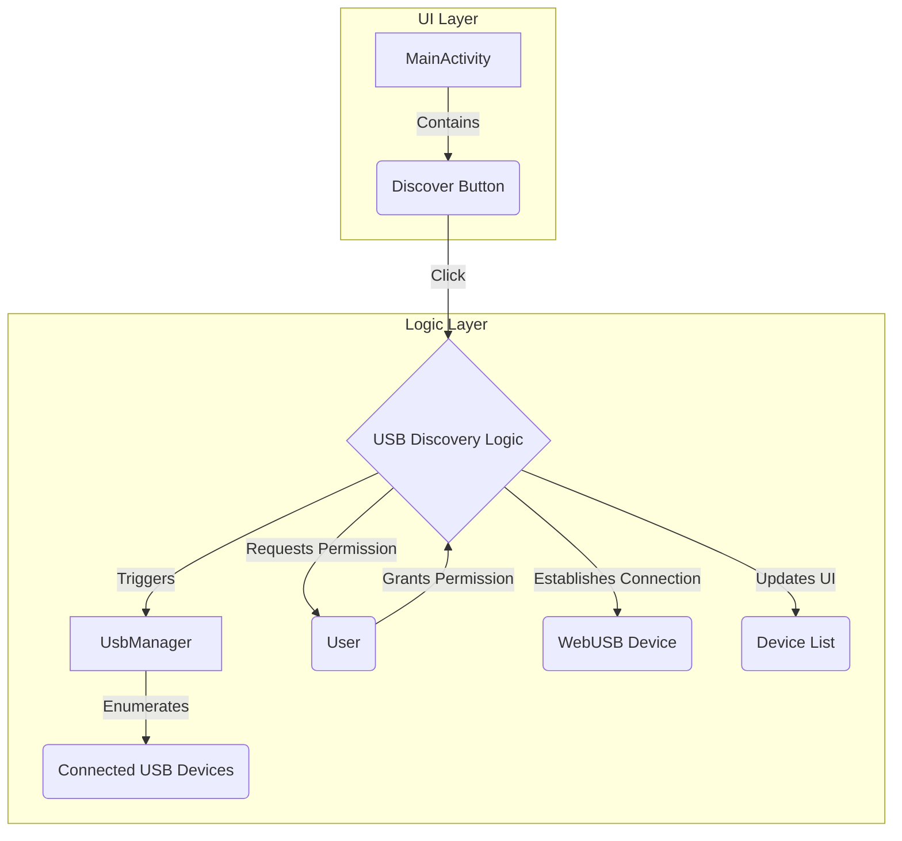

### **Proposal: Implementing WebUSB Device Discovery**

This proposal outlines the necessary changes to implement a "Discover" button that will allow the application to find and connect to WebUSB devices. The implementation will follow best practices for Android development and will be structured to be easily maintainable and extensible.

#### **1. Plan Overview**

The implementation will be broken down into the following steps:

1.  **Update Dependencies:** Add the `usb-serial-for-android` library to handle USB communication.
2.  **Configure `AndroidManifest.xml`:** Declare the necessary USB host feature and add an intent filter to detect when a USB device is connected.
3.  **Create `device_filter.xml`:** Define the specific USB devices the application should look for.
4.  **Update `MainActivity.kt`:**
    *   Add a "Discover" button to the UI.
    *   Implement the logic to discover, request permission for, and connect to USB devices.
    *   Display the list of discovered devices.

#### **2. Mermaid Diagram**

The following diagram illustrates the proposed architecture and workflow:



#### **3. Detailed Steps**

*   **Update `build.gradle.kts`:**
    Add the following dependency to `app/build.gradle.kts`:
    ```kotlin
    implementation("com.github.mik3y:usb-serial-for-android:3.7.0")
    ```

*   **Update `AndroidManifest.xml`:**
    Add the following to `app/src/main/AndroidManifest.xml`:
    ```xml
    <uses-feature android:name="android.hardware.usb.host" />
    ```
    And within the `<activity>` tag for `MainActivity`:
    ```xml
    <intent-filter>
        <action android:name="android.hardware.usb.action.USB_DEVICE_ATTACHED" />
    </intent-filter>

    <meta-data
        android:name="android.hardware.usb.action.USB_DEVICE_ATTACHED"
        android:resource="@xml/device_filter" />
    ```

*   **Create `device_filter.xml`:**
    Create a new file at `app/src/main/res/xml/device_filter.xml` with the following content:
    ```xml
    <?xml version="1.0" encoding="utf-8"?>
    <resources>
        <!-- This is an example vendor ID. Replace with the actual vendor ID of your device. -->
        <usb-device vendor-id="9025" />
    </resources>
    ```

*   **Update `MainActivity.kt`:**
    The `MainActivity.kt` will be updated to include the "Discover" button and the logic for handling USB device discovery. This will involve using the `UsbManager` to get a list of connected devices and then requesting permission from the user to access them.